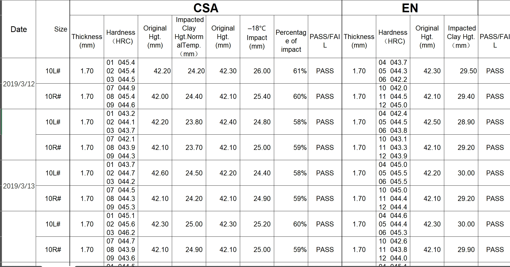

# Excel Data Transformer

A React component for transforming and processing material test data from Excel files.

## Prerequisites

- Node.js (v14.0.0 or higher)
- npm (v6.0.0 or higher) or yarn (v1.22.0 or higher)
- Modern web browser (Chrome, Firefox, Safari, or Edge)

## Installation

```bash
# Clone the repository
git clone https://github.com/mengyaozhang888/data-transformer.git

# Install dependencies
npm install
# or
yarn install
```

## Usage

```bash
# Start development server
npm start
# or
yarn start
```

## Required Excel Format

The input Excel file must follow this structure:



### Required Columns:

**Header Section:**

- Style NO. (e.g., 314-6WF)
- Date
- Size (e.g., 10L#, 10R#)

**CSA Section:**

- Thickness (mm)
- Hardness (HRC) - Multiple readings per cell (01 045.4, 02 045.4, etc.)
- Original Hgt. (mm)
- Impacted Clay Hgt.NormalTemp. (mm)
- Original Hgt. (mm)
- -18°C Impact (mm)
- Percentage of impact
- PASS/FAIL

**EN Section:**

- Thickness (mm)
- Hardness (HRC) - Multiple readings per cell
- Original Hgt. (mm)
- Impacted Clay Hgt. (mm)
- PASS/FAIL

### Data Format Examples:

- Hardness readings: "01 045.4\n02 045.4\n03 044.5"
- Size format: "10L#" or "10R#"
- Thickness: 1.70
- Height measurements: 42.20
